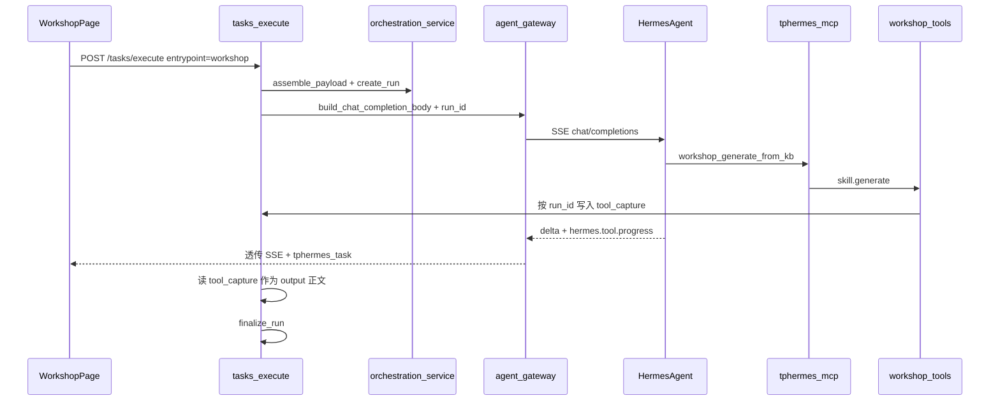
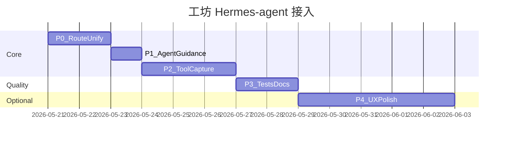

# 工坊接入 Hermes-agent 完整优化计划

## 背景与目标

当前 [`backend/routes/tasks.py`](backend/routes/tasks.py) 在 `entrypoint == "workshop"` 时走独立分支，调用 [`backend/services/workshop_task_runner.py`](backend/services/workshop_task_runner.py) 本地执行 `skill.generate()`，**不经过** Hermes-agent。对话/chat 则经 [`backend/services/agent_gateway.py`](backend/services/agent_gateway.py) 转发至 `HERMES_CHAT_API_URL`（默认 `:8642/v1/chat/completions`）。

这与 [`guide/编排改造方案.md`](guide/编排改造方案.md)、[`guide/功能调整.md`](guide/功能调整.md) 的目标不一致。你已确认：

- **默认**：Hermes-agent；`WORKSHOP_EXECUTION_MODE=direct` 作 fallback
- **落库正文**：优先取自 `workshop_generate` / `workshop_generate_from_kb` 的 **tool 结果**，而非 assistant 闲聊文本

## 目标架构

## 已完成项（本轮不再重复开发）

以下已在近期会话中落地，计划中将作为 **Agent 模式的基线依赖**：

| 项 | 位置 |
|---|---|
| 工坊请求带 `X-User-ID` / `user_id` | [`src/app/workshop/page.tsx`](src/app/workshop/page.tsx) |
| 场景绑定版本自动同步（发布 + 执行） | [`backend/routes/scenarios.py`](backend/routes/scenarios.py)、[`backend/services/orchestration_service.py`](backend/services/orchestration_service.py) |
| 产出物仅图标 + 多文件 artifacts | [`src/components/workshop-output-panel.tsx`](src/components/workshop-output-panel.tsx)、[`src/lib/workshop-output-artifact.ts`](src/lib/workshop-output-artifact.ts) |

---

## 阶段 P0：执行模式开关与路由统一（1–2 天）

### 后端

1. 新增环境变量（写入 [`guide/环境变量表.md`](guide/环境变量表.md)）：
   - `WORKSHOP_EXECUTION_MODE`：`agent`（默认）| `direct`
2. 重构 [`backend/routes/tasks.py`](backend/routes/tasks.py)：
   - 将现有 `run_workshop_skill_async` 分支提取为 `_execute_workshop_direct(...)`
   - `WORKSHOP_EXECUTION_MODE=agent` 时，工坊在 `create_run` 之后 **汇入现有 Hermes 流式/非流式路径**（与 chat 共用 `build_chat_completion_body` + `event_stream`）
   - 保留工坊专有前置逻辑：`source_output_id` 处理、`_validate_task_request`、`_ensure_workshop_binding`
3. 日志：在 execute 入口打印 `workshop_execution_mode=agent|direct run_id=...`，便于排查「改了代码但进程未重启」类问题

### 前端

- 无需改 API 契约；[`src/app/workshop/page.tsx`](src/app/workshop/page.tsx) 继续 `POST /tasks/execute`
- 可选：执行结果区展示 `execution_mode`（从 `tphermes_task` 或 run 详情读取，P2 再做）

### 验收

- `WORKSHOP_EXECUTION_MODE=direct`：现有 [`tests/test_orchestration_regression.py`](tests/test_orchestration_regression.py) 中工坊用例全部通过
- `WORKSHOP_EXECUTION_MODE=agent` + Mock Hermes：请求确实转发到 upstream（可用 httpx mock）

---

## 阶段 P1：工坊专用 Agent 指令与消息构造（1 天）

### 扩展 [`backend/services/agent_gateway.py`](backend/services/agent_gateway.py)

新增 `_build_workshop_agent_guidance(payload, *, skill_name, task_input, run_id)`，在 `entrypoint=workshop` 时追加硬约束：

- **必须**调用 MCP 工具 `workshop_generate` 或（当 `knowledge.collections` 含项目 KB 时）优先 `workshop_generate_from_kb`
- `skill_name` 固定为场景/请求指定的唯一技能（来自 `payload.skills.allowed[0]`）
- 调用时在 `context` 中传入：
  - `task_input` 全字段
  - `tphermes_run_id`（见 P2）
  - `project_id` / `scenario_id`
- **禁止**跳过工具直接输出最终正文
- 工具成功后，assistant 可输出一句短摘要，但**落库不依赖**该摘要

### 扩展 [`backend/services/orchestration_service.py`](backend/services/orchestration_service.py)

- 工坊模式下构造更明确的 `user_message`（或在 gateway 层追加一条 synthetic user turn），包含任务标题、模式（generate/refine）、指定 skill
- 将 `run_id` 写入 `OrchestrationPayload` 的 `execution` 或 `extra` 字段（需扩展 schema 或在 snapshot 中携带）

### 验收

- orchestration preview / 工坊「Agent 执行预览」JSON 中可见 run_id、skill、task_input
- Hermes 日志中可见对 `workshop_generate*` 的 tool call

---

## 阶段 P2：Tool 结果捕获与 output 落库（核心，2–3 天）

### 问题

Hermes Chat Completions SSE **不包含**完整 tool result（仅有 `event: hermes.tool.progress` 生命周期）。MCP 运行在 **独立进程** [`backend/mcp_http_server.py`](backend/mcp_http_server.py)，无法用内存 contextvars 回传。

### 方案：run_id 跨进程落库

1. **DB 捕获表或列**（二选一，推荐轻量列）：
   - 方案 A：在 `orchestration_runs` 增加 `tool_capture_json`（nullable）
   - 方案 B：新表 `workshop_tool_captures(run_id, tool_name, payload_json, created_at)`
2. 修改 [`backend/tools/workshop_tools.py`](backend/tools/workshop_tools.py)：
   - `workshop_generate` / `workshop_generate_from_kb` 完成后，若 `context.get("tphermes_run_id")` 存在，则写入 capture
   - 提取正文优先级：`generation.content` > `content` > JSON 全文
   - 记录 `used_skill`、`collection_name`（如有）
3. 修改 [`backend/routes/tasks.py`](backend/routes/tasks.py) 流式结束逻辑：
   - 新增 `_resolve_workshop_output_text(run_id, full_text_sse, payload) -> str`
   - **优先**读 DB capture；若无 capture 且 mode=agent，返回 502/424 明确错误（「Agent 未调用 workshop 工具」）
   - `direct` 模式仍用 skill 返回值
4. Agent 指令（P1）要求 MCP `context` 必含 `tphermes_run_id`

### 流式 UX

- SSE 仍透传 Hermes delta（用户可看到进度）
- 最终 `tphermes_task` 中的 output 内容来自 capture，与现工坊 JSON/Markdown 展示兼容
- [`deriveWorkshopArtifacts`](src/lib/workshop-output-artifact.ts) 继续适用

### 验收

- Agent 调 `a4_skill` 后，落库内容与 direct 模式 skill 输出一致（结构 JSON + 内嵌 markdown）
- Agent 未调工具时：明确失败，不写入空 output
- refine 模式 + KB hint：Agent 走 `workshop_generate_from_kb`，capture 含 KB 元数据

---

## 阶段 P3：测试、可观测性与文档（1–2 天）

### 测试

| 类型 | 内容 |
|---|---|
| 单元 | `_resolve_workshop_output_text`、capture 写入/读取、guidance 生成 |
| 集成 | mock upstream SSE + 模拟 MCP capture；direct/agent 双模式 |
| 回归 | 更新 [`tests/test_orchestration_regression.py`](tests/test_orchestration_regression.py)：`test_workshop_execute_*` 在 `direct` 下保持；新增 `test_workshop_agent_mode_uses_tool_capture` |

建议新增 `tests/test_workshop_agent_mode.py`，用 TestClient + respx/httpx mock Hermes，并在测试内直接调用 workshop_tools 模拟 capture。

### 可观测性

- `finalize_run` 的 `response_metadata` 增加：`execution_mode`、`used_skills`、`tool_capture_hit`（bool）
- 项目 runs 列表可区分 agent/direct（[`src/app/projects/[id]/page.tsx`](src/app/projects/[id]/page.tsx) 后续小改）

### 文档

- 更新 [`guide/环境变量表.md`](guide/环境变量表.md)：`WORKSHOP_EXECUTION_MODE`
- 更新 [`guide/页面与接口映射.md`](guide/页面与接口映射.md)：工坊执行链路说明
- 在 [`guide/编排改造方案.md`](guide/编排改造方案.md) 标记「工坊 Agent 化」里程碑完成状态

---

## 阶段 P4：体验增强与后续统一（可选，1 周+）

1. **工坊 UI**
   - 执行中展示 tool progress（解析 `event: hermes.tool.progress`）
   - 多 output 文件：若 Agent 多次调用工具，capture 支持 artifacts 数组，前端 [`WorkshopOutputPanel`](src/components/workshop-output-panel.tsx) 已支持 `artifacts[]`
2. **与 chat 完全同构**
   - `/create`、`quick_create` 入口统一 agent 路径（文档 P4 目标）
3. **降级策略**
   - Agent 502 且 `WORKSHOP_EXECUTION_MODE=agent` 时，可选 `WORKSHOP_AGENT_FALLBACK_DIRECT=true` 自动重试 direct（仅 dev）
4. **移除 direct**（远期）
   - 稳定运行后 deprecate `direct`，测试 CI 默认 agent + mock

---

## 关键文件清单

| 文件 | 改动 |
|---|---|
| [`backend/routes/tasks.py`](backend/routes/tasks.py) | 模式分支、汇入 agent 流、output 解析 |
| [`backend/services/agent_gateway.py`](backend/services/agent_gateway.py) | 工坊专用 system 指令、run_id 注入 |
| [`backend/services/workshop_task_runner.py`](backend/services/workshop_task_runner.py) | 保留为 direct 专用 |
| [`backend/tools/workshop_tools.py`](backend/tools/workshop_tools.py) | run_id capture 写入 |
| [`backend/services/run_log_service.py`](backend/services/run_log_service.py) | capture 读写 helper |
| [`backend/db/sqlite_migrate.py`](backend/db/sqlite_migrate.py) | tool_capture 字段迁移 |
| [`backend/schemas/orchestration.py`](backend/schemas/orchestration.py) | 可选 run_id / execution 扩展 |
| [`tests/test_orchestration_regression.py`](tests/test_orchestration_regression.py) | 双模式测试 |
| [`guide/环境变量表.md`](guide/环境变量表.md) | 文档 |

---

## 风险与缓解

| 风险 | 缓解 |
|---|---|
| Hermes 未调 MCP 工具 | 强 prompt + capture miss 明确报错；dev 可 fallback direct |
| MCP 与 backend 不同进程 | **必须** DB capture，不用内存 |
| SSE 无 tool result | 不依赖 SSE 解析，只依赖 capture |
| 输出格式变化 | 继续用 `deriveWorkshopArtifacts`；capture 存原始 skill 输出 |
| 本地 Hermes 未启动 | 与 chat 一致返回 502；start.sh 文档强调依赖 |
| 测试依赖真实 LLM | mock upstream + 直接写 capture 测落库 |

---

## 建议排期（合计约 5–8 天）

**DoD（完成定义）**：

1. 默认 `WORKSHOP_EXECUTION_MODE=agent` 下，工坊「开始生成」经 Hermes-agent 调用 MCP 工具并成功落库
2. output 正文与 direct 模式 skill 输出一致（以 capture 为准）
3. `direct` fallback 可用，CI 回归通过
4. 环境变量与执行链路文档更新
