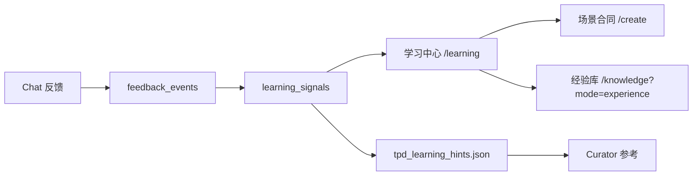

# 系统成长性

缺失是递进关系：**没有反馈信号 → 无法主动学习 → 知识积累无据可依**。

**产品决策（当前）**：以 **Web Chat UI** 为唯一主反馈入口；飞书 Reaction / 飞书追问 / 飞书周报推送暂不纳入迭代范围。

---

## 主闭环（后续迭代均围绕此链路）



| 环节 | 说明 | 入口 / 实现 |
|------|------|-------------|
| **反馈捕获** | 👍/👎、采纳、重写 | Chat 消息快捷栏 → `POST /api/v1/feedback` |
| **学习决策** | 聚类生成开放信号、周报 | `learning_service` → `/learning` |
| **人工闭环** | 改场景、标记已处理、沉淀经验 | `/create?scenario=…`、经验库 Tab |
| **后台辅助** | 定期分析、导出 hints | `growth_scheduler`（`GROWTH_SCHEDULER_ENABLED`） |

统一 memory 行格式（写入 `feedback_events.memory_line`）：

```
[feedback] {日期} {session_id} {场景} {full|partial|reject} run={run_id} {原因}
```

---

## 第一层：反馈信号（Web Chat）

### 已实现

- Chat 助手回复绑定 `runId` / `outputId`，快捷操作提交结构化反馈
- `feedback_events` 表 + 采纳率 / 重写率统计（`/feedback/stats`）
- 采纳 / 👍 可选写入 **TPD 经验库** `public.internal_methodology.tpd_experience`

### 待补（Web 内，非飞书）

- **24h 追问 UI**：`feedback_prompts` 已入队，需在 Chat 会话内提示「上文采纳了吗？」并引导点采纳/重写
- （可选）将高价值 `memory_line` 同步到 Hermes memory 插件；当前以 DB + 经验库为主

---

## 第二层：学习决策

### 已实现

- 规则聚类：`repeated_correction`、`low_adoption_scenario`、`kb_miss` 等 → `learning_signals`
- 学习中心：指标、开放信号、周报；信号支持 **去改场景**、**标记已处理**
- 每周摘要：`learning_reports` + `POST /learning/reports/weekly`
- Curator：读取 `data/tpd_learning_hints.json`（由 scheduler 导出开放信号）

### 待补

- 学习信号与场景改动的 **效果回验**（改配置后采纳率是否上升）
- Curator 侧仍为「提示型」，不自动改 Skill/KB

---

## 第三层：知识积累

### 五层模型

```
第1层：原始语料  → KB（geely_tech、竞品策略等）
第2层：经验知识  → tpd_experience（采纳/纠正后的可复用片段）
第3层：工作流程  → Skill
第4层：场景合同  → ScenarioProfile（/create）
第5层：判断偏好  → memory_line / 经验库 metadata
```

### 已实现

- `tpd_experience` 集合合同 + `experience_entries` 索引
- 知识库 **经验库** Tab：`/knowledge?mode=experience`

---

## 关键 API（便于联调）

| 方法 | 路径 | 用途 |
|------|------|------|
| POST | `/api/v1/feedback` | 提交反馈 |
| GET | `/api/v1/feedback/stats` | 成长性指标 |
| POST | `/api/v1/learning/analyze` | 运行聚类分析 |
| GET | `/api/v1/learning/signals` | 开放学习信号 |
| PATCH | `/api/v1/learning/signals/{id}` | 标记已处理 `{ "status": "ack" }` |
| POST | `/api/v1/learning/reports/weekly` | 生成周报 |

---

## 明确不做（现阶段）

- 飞书 Reaction → feedback API
- 飞书群「24h 确认」「周报推送」
- Gateway synthetic `reaction:*` 解析 Skill

---

## 反模式

- ❌ 在飞书侧重复造反馈采集，与 Web Chat 双轨不一致
- ❌ 只存 KB 不采反馈，无法区分「写进去了」和「写对了」
- ❌ 学习信号只展示、不提供「去改场景 / 标记已处理」闭环

*Last Updated: 2026-05-26*
