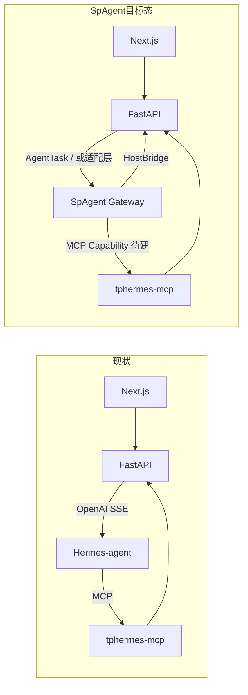

# SpAgent 替代 Hermes-agent 作为 TPDHermes 内核 — 评估结论

## 1. 当前集成关系

TPDHermes 与 Hermes-agent 是**进程级解耦**，不是 Python 包依赖：

| 层 | 职责 | 协议 |
|---|---|---|
| TPDHermes (FastAPI) | 编排合同、业务持久化、MCP 工具实现 | `OrchestrationPayload` |
| Hermes-agent (:8642) | 多轮推理、工具选择、SSE 流式输出 | OpenAI `/v1/chat/completions` |
| tphermes-mcp (:8801) | KB / 工坊 / 项目能力暴露 | MCP |

主链路：`POST /tasks/execute` → 组装编排 → 转发 Hermes → Hermes 调 MCP → `tool_capture` 落库。

**Hermes 在内核侧实际承担的事：**
- 解析 system 中的编排 JSON / 指引
- 连接 `tphermes` MCP，调用 `kb_query`、`workshop_generate*` 等
- 多轮 tool-calling 直至产出
- OpenAI 兼容 SSE 回传

---

## 2. SpAgent 现状

SpAgent（`core-agent` v0.1.0）是 **TypeScript Headless Agent 内核**，架构清晰：

- 自研 `run-loop`（非 LangGraph）
- `HostBridge`：宿主注入上下文、审批、审计 — **与 TPD「编排层 + 执行层」理念高度契合**
- `CapabilityRegistry v2` + Policy / Session / Checkpoint / Job

但对外接口与 TPD 现有契约**不一致**：

| 维度 | TPDHermes 期望 | SpAgent 现状 |
|---|---|---|
| HTTP 协议 | OpenAI `/v1/chat/completions` + SSE | `/v1/tasks/run`、`/v1/tasks/stream`（`AgentTask`） |
| 工具模型 | MCP 客户端，动态发现 tphermes 工具 | 内置 3 个 capability，**无 MCP 客户端** |
| 任务契约 | `OrchestrationPayload` → system prompt | `AgentTask.goal` + `contextRefs` + `allowedCapabilities` |
| 运行时 | Python（与 backend 同生态） | Node.js / TypeScript |
| 成熟度 | 已在 TPD 联调验收 | MVP，P0/P1 仍在演进 |

---

## 3. 能力对照

### ✅ SpAgent 优势（相对 Hermes 作为内核）

1. **宿主边界更清晰** — `HostBridge.resolveContext()` 可直接映射 `OrchestrationPayload`，比「把 JSON 塞进 system prompt」更结构化。
2. **治理能力强** — Policy 白名单、审批链、审计、脱敏、checkpoint/replay，适合企业内容生产场景。
3. **代码体量可控** — 无 Hermes 的 IM/Gateway/CLI 等无关能力，便于 TPD 团队定制。
4. **消除双 Skills 混乱** — 不再存在 Hermes 内嵌 Skills 与 TPD `skills/` 并行的问题。
5. **与前端技术栈一致** — TypeScript，便于同一团队维护执行层。

### ❌ 关键缺口（阻塞直接替换）

1. **无 MCP 客户端（P0 级）**  
   TPD 全部业务能力经 `tphermes-mcp` 暴露。SpAgent 源码中无 MCP 相关实现。没有 MCP，工坊 Agent 模式（`workshop_generate*` + `tphermes_run_id` + `tool_capture`）无法工作。

2. **API 不兼容（P0 级）**  
   `agent_gateway.py` 硬编码转发 OpenAI Chat Completions 格式。SpAgent 网关是自有 `AgentTask` 协议，需改 TPD 网关或给 SpAgent 加 OpenAI 兼容层。

3. **工具生态空白**  
   Hermes 通过 `deploy/hermes-agent/config.yaml` 配置 MCP 白名单（kb、workshop、tavily 等）。SpAgent 仅 `knowledge_lookup` / `http_fetch` / `host_action_proxy`，需把 tphermes 全量工具桥接为 capability。

4. **流式与 tool 结果格式**  
   TPD 的 `parse_sse_data_line()`、`workshop_tool_capture` 依赖 OpenAI SSE delta 与 MCP 工具返回结构，需验证 SpAgent 事件流能否等价映射。

5. **部署复杂度**  
   当前 docker-compose 三容器：`backend` + `hermes-agent` + `tphermes-mcp`。换 SpAgent 需新增 Node 执行服务，运维面从 Python 扩到 Python + Node。

---

## 4. 架构对比

---

## 5. 替换路径与工作量（粗估）

| 方案 | 做法 | 工作量 | 风险 |
|---|---|---|---|
| **A. 直接替换** | 停 Hermes，上 SpAgent | 高（4–8 周） | 高，当前不可行 |
| **B. 适配层** | SpAgent + OpenAI 兼容 shim + MCP Capability Bridge | 中（2–4 周） | 中，推荐 |
| **C. SDK 深嵌** | TPD 新建 Node 微服务，实现完整 `HostBridge` | 中高（3–5 周） | 中，长期最优 |
| **D. 维持 Hermes** | SpAgent 补齐 MCP + OpenAI 服务端后再切 | 低（短期） | 低 |

### 方案 B/C 的最小交付清单

1. **MCP Capability Provider** — 连接 `tphermes-mcp`，动态注册 `kb_*` / `workshop_*` / `project_*`
2. **Orchestration → AgentTask 映射** — 替代 prompt 嵌入 JSON
3. **OpenAI 兼容端点（可选）** — 减少 `agent_gateway.py` 改动；或直接改 gateway 调 `/v1/tasks/stream`
4. **SSE 事件映射** — SpAgent `model.delta` / capability 事件 → TPD 现有解析逻辑
5. **工坊验收** — `tool_capture_json` 闭环、424 失败检测、模板校验

---

## 6. 综合结论

| 评估项 | 结论 |
|---|---|
| **架构理念** | ✅ SpAgent 的 HostBridge + Headless 设计**更适合** TPDHermes 长期架构 |
| **当前可替换性** | ❌ **不能直接替换**，MCP 与 API 契约是硬阻塞 |
| **战略价值** | ✅ 可控内核、治理增强、消除 Hermes 冗余能力 |
| **短期建议** | **维持 Hermes-agent**，SpAgent 按 P0 优先补 MCP Bridge |
| **中期目标** | SpAgent 作为 `tphermes-executor`  sidecar，TPD 通过 `HostBridge` 做编排 |

**一句话：** SpAgent 在「宿主—内核」分层上比 Hermes 更贴合 TPDHermes 的产品定位，但 v0.1.0 缺少 **MCP 工具链** 和 **OpenAI 兼容执行面**，尚不能承担当前已验收的工坊/对话 Agent 闭环。建议以 **「SpAgent 执行服务 + MCP Capability Bridge + Orchestration 结构化映射」** 为迁移目标，分 2 阶段推进：先 parity（功能对齐），再 superiority（Policy/Checkpoint/Job 等治理增强）。

---

## 7. 建议的 Phase 划分

**Phase 1 — Parity（2–3 周）**
- SpAgent 实现 MCP Client Capability
- 新建 `tphermes-host` 示例：注册 tphermes 全工具 + OpenAI 模型
- 对接 `/tasks/execute` 工坊链路，跑通 `verify.sh` 同等验收

**Phase 2 — Switch（1 周）**
- docker-compose 用 `spagent-executor` 替换 `hermes-agent`
- 环境变量 `HERMES_CHAT_API_URL` → `SPAGENT_EXECUTOR_URL`
- 保留 Hermes 作 fallback

**Phase 3 — Enhance（持续）**
- 用 `HostBridge.resolveContext` 替代 prompt 注入编排
- Policy 按 `skills.allowed` / `knowledge.collections` 做能力门禁
- Checkpoint 支持工坊长任务恢复
