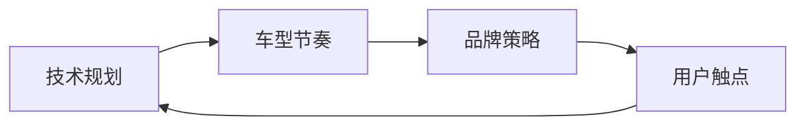

# {{title}}

> 基于「{{template_source}}」标准化模板 | 适用场景：技术规划与品牌策略的协同对齐

---

## 互锁关系总览

---

## 一、技术规划节点

| 时间节点 | 技术里程碑 | 对应车型 | 品牌绑定点 |
|---------|----------|---------|-----------|
{{technology_node_rows}}

---

## 二、车型节奏映射

| 车型 | 上市时间 | 搭载技术 | 品牌赋能重点 |
|------|---------|---------|-----------|
{{model_timeline_rows}}

---

## 三、品牌策略联动

| 品牌动作 | 联动技术节点 | 目标用户触点 |
|---------|------------|------------|
{{brand_action_rows}}

---

## 四、用户触点规划

| 触点 | 技术传递信息 | 品牌调性 | 渠道 |
|------|------------|---------|------|
{{user_touchpoint_rows}}

---

## 五、互锁核查清单

{{checklist}}

---

*模板版本：{{template_version}} | 来源：{{template_source}}*
